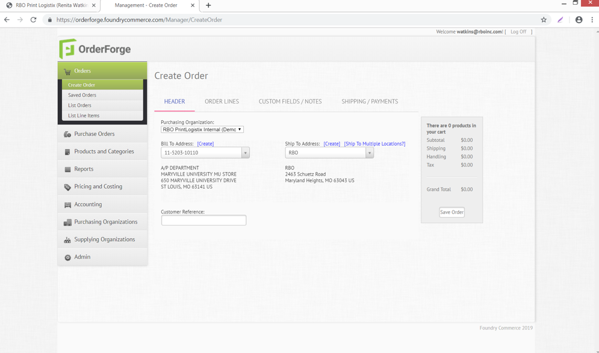
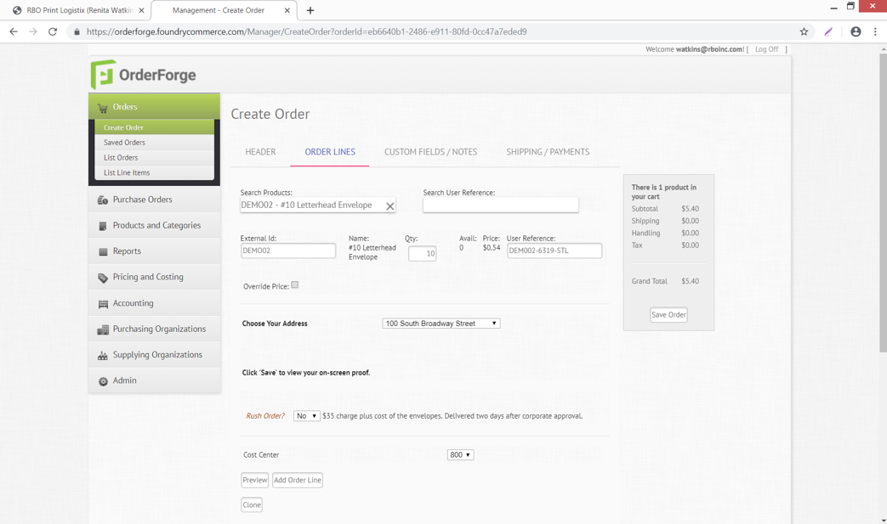
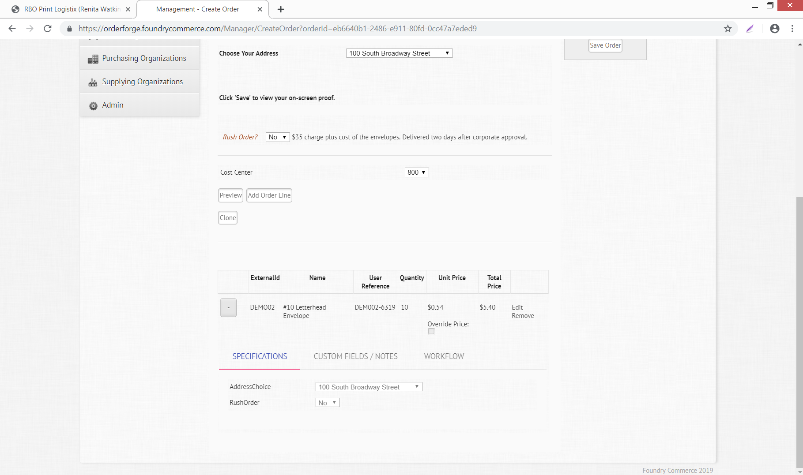
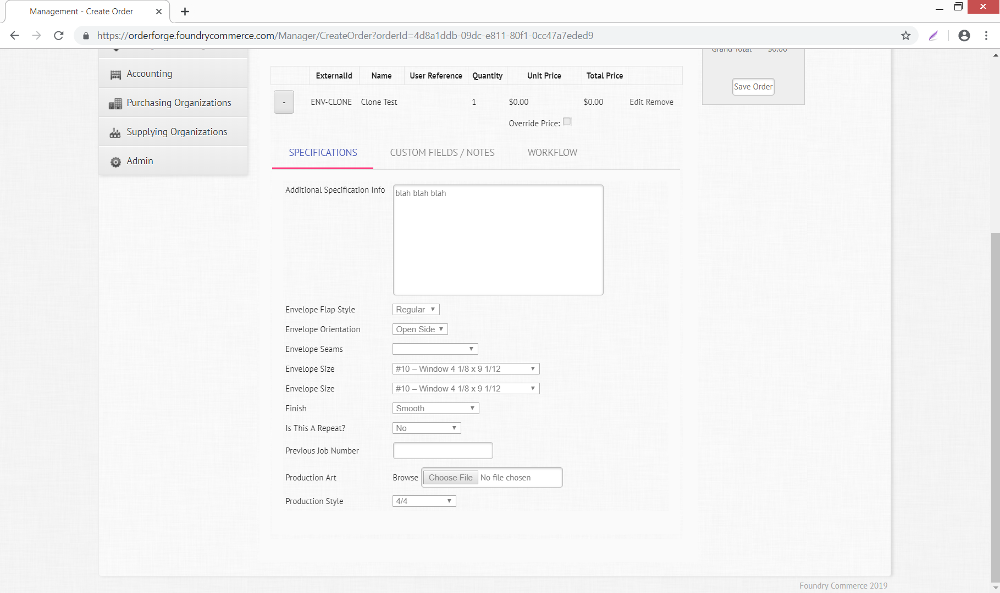
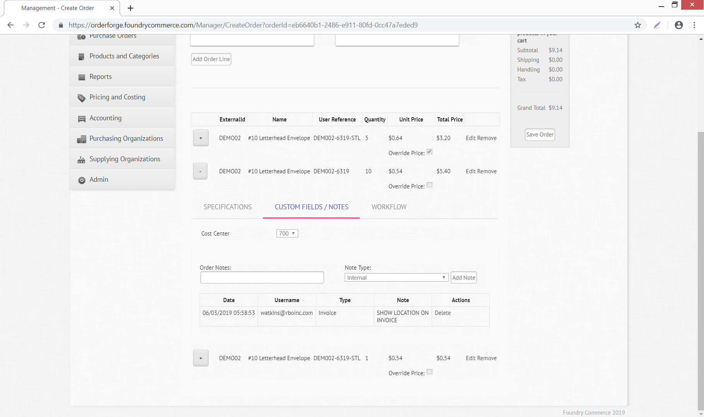

# Create Order

## Header Tab

Choose purchasing organization (Customer) - choose bill to and ship to (create if necessary – your new address will only be available from manual order entry view – must add to OrderForge store front if needed there) – Customer reference is designated at an order level (use for Customer PO#)

You can save your order (Saved order button) at any time when processing and return later to complete or resume with next tab. 

## Order Lines Tab

**Search products** – search for existing products setup – you can clone (located towards the bottom of screen) that product and save using your customer’s product naming convention. *Example: DEMO02 pull product and clone then save under product #TEST022 - #10 LH Envelope. Then you can make any changes you want to the product you created.*
**Search User Reference** – is used to search for the last time this product was ordered to do a repeat, but a user reference must have been added when the product was last ordered. 
**External id** – product you are ordering
**Quantity**
**Avail** – inventory level available
**Unit of issue**
**Price** – sell to customer
**User Reference** – used to pull product up again later to repeat (last time ordered will pull)
**Override price** – you can check this and override pricing that shows prefilled in the pricing area
**Cost Center** – this is a special added feature for this customer
**Preview** – proof review for this the line item entered, for variable products only.
When finished click add order line button

Your order line will appear at the bottom of the screen - Click the + sign to open up your view of the product – additional tabs will appear under the product, which are product specific information needed to process that product line.

Click the **edit** to enable the ability to make changes to the product line. When finished with changes click **update.**

**Specifications** – detail of information pertaining to the product specifically – below you will see information about an item such as stock, size, type of envelope. This information is added to the specification tab when a product is created in OrderForge

**Custom Fields/Notes** – customized information collected for that specific product line – this example shows a cost center and also some internal invoice notes for accounting.

As you add notes you will need to choose from the Note Type drop down box, enter your notes in the Order Notes box and then click Add Notes button. If you choose Supplier those notes will appear on the PO sent to the supplier.

You also have the option to delete the notes if you need to or add additional ones.

Workflow – ability to create the Order and have it generate a PO automatically to the supplier by assigning a workflow. Workflow is created per product added to the Order.
Default - option to use a workflow that was created when the product was originally setup